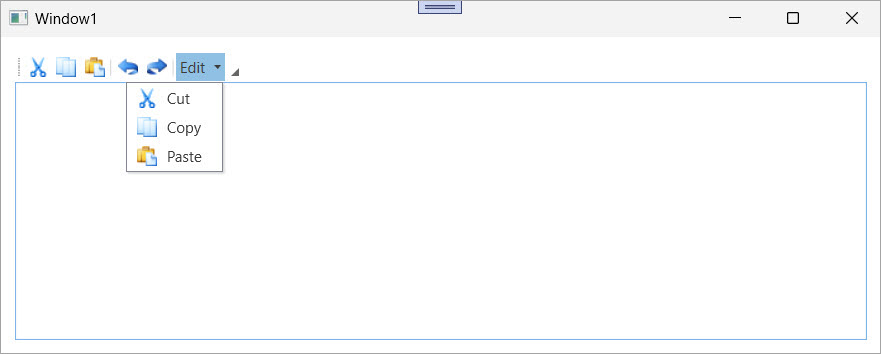

<!-- default badges list -->

[](https://supportcenter.devexpress.com/ticket/details/E1562)
[](https://docs.devexpress.com/GeneralInformation/403183)
[](#does-this-example-address-your-development-requirementsobjectives)
<!-- default badges end -->

# WPF Bars - Create a Container for BarItem Links

This example uses the [`BarLinkContainerItem`](https://docs.devexpress.com/WPF/DevExpress.Xpf.Bars.BarLinkContainerItem) property to group related bar items and reuse them across different containers.



Use this technique when you need to:

* Define a set of commands (such as `Cut`, `Copy`, and `Paste`) once and reuse them in multiple locations (for example, in a bar or a submenu).
* Keep your [`BarManager`](https://docs.devexpress.com/WPF/DevExpress.Xpf.Bars.BarManager) layout consistent and avoid duplicating command definitions.
* Dynamically extend or reorganize bar content without redefining individual item links.

This solution simplifies maintenance and improves clarity when you work with toolbars that include common command groups.

## Implementation Details

### Bar Items

The example defines five [`BarButtonItem`](https://docs.devexpress.com/WPF/DevExpress.Xpf.Bars.BarButtonItem) objects that correspond to common edit operations:

```xaml
<dxb:BarButtonItem x:Name="itemCut" Content="Cut" />
<dxb:BarButtonItem x:Name="itemCopy" Content="Copy" />
<dxb:BarButtonItem x:Name="itemPaste" Content="Paste" />
<dxb:BarButtonItem x:Name="itemUndo" Content="Undo" />
<dxb:BarButtonItem x:Name="itemRedo" Content="Redo" />
```
### Group Commands in a BarLinkContainerItem

Use the [`BarLinkContainerItem`](https://docs.devexpress.com/WPF/DevExpress.Xpf.Bars.BarLinkContainerItem) property to group `Cut`, `Copy`, and `Paste` commands into a single reusable unit. This container holds links to existing [`BarButtonItem`](https://docs.devexpress.com/WPF/DevExpress.Xpf.Bars.BarButtonItem) elements:

```xaml
<dxb:BarLinkContainerItem x:Name="linkContainerItem1" Content="Edit Commands">
    <dxb:BarLinkContainerItem.ItemLinks>
        <dxb:BarButtonItemLink BarItemName="itemCut" />
        <dxb:BarButtonItemLink BarItemName="itemCopy" />
        <dxb:BarButtonItemLink BarItemName="itemPaste" />
    </dxb:BarLinkContainerItem.ItemLinks>
</dxb:BarLinkContainerItem>
```

### Reuse the Container in a Submenu

You can reuse the container in a [`BarSubItem`](https://docs.devexpress.com/WPF/DevExpress.Xpf.Bars.BarSubItem), which acts as a submenu in the UI:

```xaml
<dxb:BarSubItem Content="Edit" x:Name="subMenu1">
    <dxb:BarSubItem.ItemLinks>
        <dxb:BarLinkContainerItemLink BarItemName="linkContainerItem1" />
    </dxb:BarSubItem.ItemLinks>
</dxb:BarSubItem>
```

### Display Items in a Toolbar

The following code example defines a top-level bar and adds both the container and the submenu, along with separators and additional items:

```xaml
<dxb:Bar x:Name="bar1" Caption="Bar 1">
    <dxb:Bar.ItemLinks>
        <dxb:BarLinkContainerItemLink BarItemName="linkContainerItem1" />
        <dxb:BarItemLinkSeparator />
        <dxb:BarButtonItemLink BarItemName="itemUndo" />
        <dxb:BarButtonItemLink BarItemName="itemRedo" />
        <dxb:BarItemLinkSeparator />
        <dxb:BarSubItemLink BarItemName="subMenu1" />
    </dxb:Bar.ItemLinks>
</dxb:Bar>
```

## Files to Review

* [Window1.xaml](./CS/BarLinkContainerItem/Window1.xaml) (VB: [Window1.xaml](./VB/BarLinkContainerItem/Window1.xaml))
* [Window1.xaml.cs](./CS/BarLinkContainerItem/Window1.xaml.cs) (VB: [Window1.xaml.vb](./VB/BarLinkContainerItem/Window1.xaml.vb))

## Documentation

* [BarContainerControl](https://docs.devexpress.com/WPF/DevExpress.Xpf.Bars.BarContainerControl)
* [BarLinkContainerItem](https://docs.devexpress.com/WPF/DevExpress.Xpf.Bars.BarLinkContainerItem)
* [Bars](https://docs.devexpress.com/WPF/6194/controls-and-libraries/ribbon-bars-and-menu/bars)

## More Examples

* [WPF Bars - Use Separators to Group Bar Item Links](https://github.com/DevExpress-Examples/wpf-bars-visually-separate-bar-items)
* [MVVM Application with WPF Bars](https://github.com/DevExpress-Examples/mvvm-application-with-wpf-bars)
* [WPF PDF Viewer - Customize the Integrated Bar's Commands](https://github.com/DevExpress-Examples/wpf-pdf-viewer-customize-bar-manager)
* [WPF MVVM Behaviors - Display Theme Selectors Based on BarItems and Hide Themes from List](https://github.com/DevExpress-Examples/wpf-mvvm-behaviors-barItems-based-theme-selectors)
* [WPF Dock Layout Manager - Merge Bars in Controls That Support Automatic Merging](https://github.com/DevExpress-Examples/wpf-docklayoutmanager-merge-bars-in-controls-that-support-automatic-merging)

<!-- feedback -->
## Does this example address your development requirements/objectives?

[](https://www.devexpress.com/support/examples/survey.xml?utm_source=github&utm_campaign=wpf-bars-create-baritem-link-container&~~~was_helpful=yes) [](https://www.devexpress.com/support/examples/survey.xml?utm_source=github&utm_campaign=wpf-bars-create-baritem-link-container&~~~was_helpful=no)

(you will be redirected to DevExpress.com to submit your response)
<!-- feedback end -->

